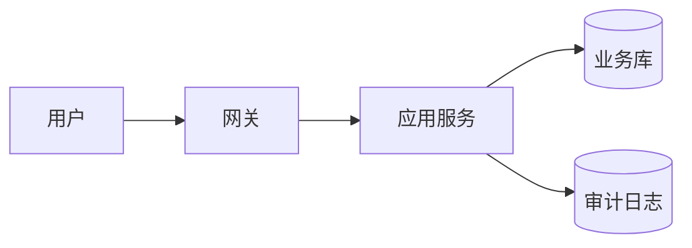
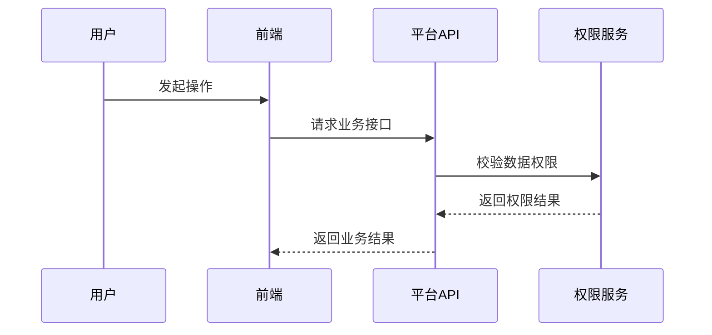
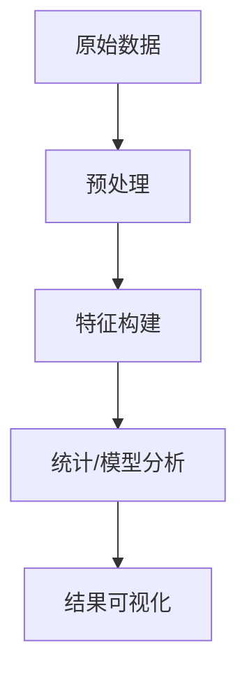

# 图示片段库（Mermaid + 文本图）

## 1. 平台业务流程图

```mermaid
flowchart LR
    U[用户] --> G[网关]
    G --> A[应用服务]
    A --> DB[(业务库)]
    A --> LOG[(审计日志)]
```

## 2. 模块交互图

```mermaid
sequenceDiagram
    participant User as 用户
    participant UI as 前端
    participant API as 平台API
    participant Auth as 权限服务
    User->>UI: 发起操作
    UI->>API: 请求业务接口
    API->>Auth: 校验数据权限
    Auth-->>API: 返回权限结果
    API-->>UI: 返回业务结果
```

## 3. 文本流程图（回退）
```text
[请求接入] -> [鉴权] -> [业务处理] -> [结果输出]
                 |
                 +-> [审计记录]
```

## 4. 分析链路图

```mermaid
flowchart TD
    A[原始数据] --> B[预处理]
    B --> C[特征构建]
    C --> D[统计/模型分析]
    D --> E[结果可视化]
```
