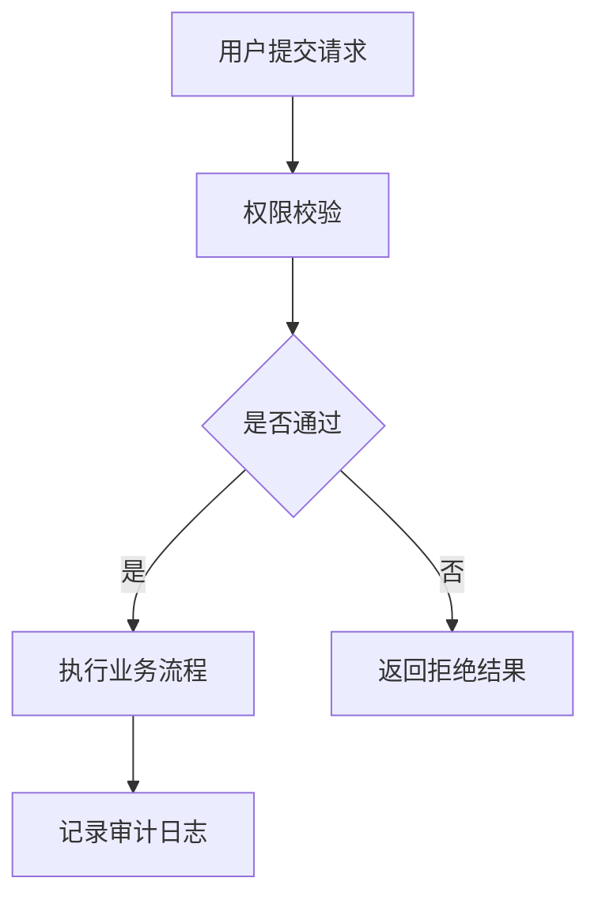

# 图文并茂规则手册

## 目标
在保证可读性的前提下，提高文档技术表达密度与审阅友好性。

## 最低图表要求
- 平台型：每一级功能域至少 1 幅图（流程图/数据流图/状态图/文本图）。
- 分析型：每个核心分析模块至少 1 幅图。
- 工具型：每个核心操作链路至少 1 幅图。

## 推荐图类型
- 业务流程图
- 模块交互图
- 数据流图
- 状态迁移图
- 输入输出样例图

## Mermaid 示例


## 文本图（无渲染环境时）
```text
[用户请求] -> [权限校验] -> [业务执行] -> [结果返回]
                     |
                     +-> [审计日志写入]
```

## 编号与引用
- 图号、表号独立连续编号。
- 正文引用统一：`如图 3 所示`、`见表 2`。
- 不允许跳号、重号或图文不对应。
